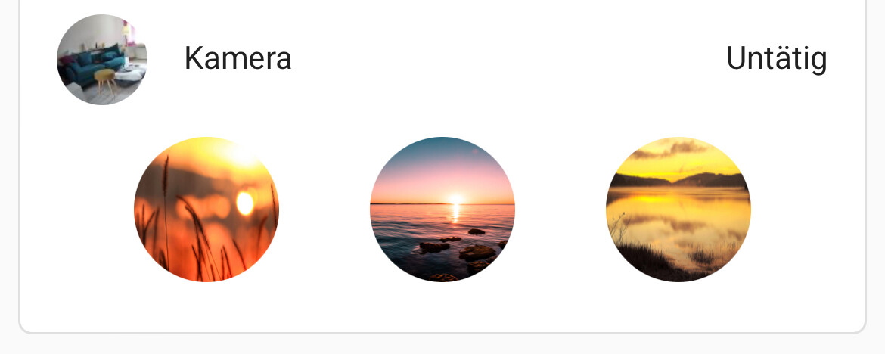

In order to phase out the Hue Bridge, I was looking for a way to have nicely colored scenes in HA, similar to the Hue ones. I am only aware of [this discussion](https://community.home-assistant.io/t/select-activate-hue-scenes-in-new-v2-api-setup/356057), but it relies on the hue bridge.

My solution relies on three parts, and is also described [here in the Home Assistant Forum](https://community.home-assistant.io/t/hue-scenes-without-hue-bridge/623711):

# 1. The script

It basically supports the following things:

- Select a room or a couple of lights
- Select a scene by name
- The scene is associated with a few color, that are distributed randomly to the participating lights
- It's possible to only apply to lights that are already on
- It's possible to skip light groups.

It can be found in `script.yaml`.

# 2. The colors

The next question: How to get the colors? The Hue app [shows them in small circles](gfx/circles.jpeg), but I thought there needs to be a better way to extract the colors. Since I still have the bridge running, I applied the scene to a number of lights, and extracted the color info via Home Asssistant with this template script:

```jinja2

[
"{{state_attr(l,"xy_color")|list }}"
,
]



{{xy}}
,

```

I used the template tool in the developer section of HA to run this, and then copied the colors into the script.

## More Colors

The above snippet can be used to extract colors from existing Hue scenes. Another source for color palettes is [this page](https://colorpalettes.net).

# 3. The UI

My dashboards are heavily based on the entities and auto-entities cards, so I wanted to integrated these scenes into that, and came up with the above UI. It uses [paper-buttons-row](https://github.com/jcwillox/lovelace-paper-buttons-row) to show the buttons. A short tap activates the scene on all lights currently on, and a double tap activates it on all lights in the area.

## Version 1



```yaml
- type: custom:paper-buttons-row
  base_config:
    name: false
    styles:
      icon:
        height: 64px;
        width: 64px;
    tap_action:
      action: call-service
      service: script.light_hue_scene
      service_data:
        onlyonlights: true
        skipgroups: true
        target:
          area_id: wohnzimmer
    double_tap_action:
      action: call-service
      service: script.light_hue_scene
      service_data:
        onlyonlights: false
        skipgroups: true
        target:
          area_id: wohnzimmer
  buttons:
    - entity: script.light_hue_scene
      image: /local/hue/savanna-sunset.jpg
      tap_action:
        service_data:
          scene: Savanna Sunset
      hold_action:
        service_data:
          scene: Savanna Sunset
    - entity: script.light_hue_scene
      image: /local/hue/horizon.jpg
      tap_action:
        service_data:
          scene: Horizon
      hold_action:
        service_data:
          scene: Horizon
    - entity: script.light_hue_scene
      image: /local/hue/golden-pond.jpg
      tap_action:
        service_data:
          scene: Golden Pond
      hold_action:
        service_data:
          scene: Golden Pond
```

## Version 2

Alternatively, if you're using [`lovelace_gen`](https://github.com/thomasloven/hass-lovelace_gen), the row definition in `ui.yaml` might be helpful.

