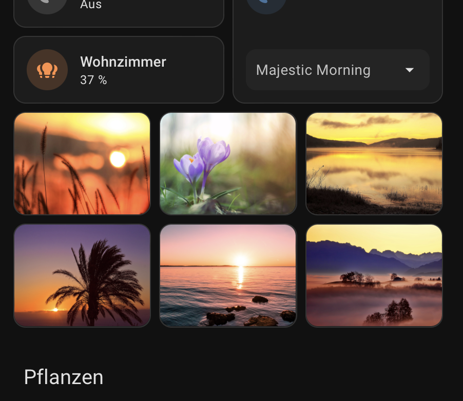

In order to phase out the Hue Bridge, I was looking for a way to have nicely colored scenes in HA, similar to the Hue ones. I am only aware of [this discussion](https://community.home-assistant.io/t/select-activate-hue-scenes-in-new-v2-api-setup/356057), but it relies on the hue bridge.

My solution relies on three parts, and is also described [here in the Home Assistant Forum](https://community.home-assistant.io/t/hue-scenes-without-hue-bridge/623711):

# 1. The script

The classic script can still be found in `script.yaml`. The current version, however, is a script blueprint, residing in `ha-scenes.yaml`.

When importing the blueprint, one has to select the lights it applies to (or areas or devices or labels), and a few other basic properties. Other features can (and need to) be selected when starting the script.

## Setting a scene
Setting a scene with this script is done via a service call:

```yaml
service: script.1712410790992
data:
  scene: Savanna sunset
  repeat_delay:
    hours: 0
    minutes: 2
    seconds: 30
  onlyonlights: false
  brightness: 100
  transition: 5
```

The exact service name depends on how you name the script. If `repeat_delay` is not specified, lights are assigned once.

# 2. The colors

I took the color definitions from [here](https://gist.github.com/Hypfer/a0a8b5b9429831a7306ec4300077eaaa). Several scenes seemed to be missing, so I added them with this snippet in the developer tools, after applying the official scene on a set of lights:


```jinja2

[
"{{state_attr(l,"xy_color")|list }}"
,
]



{{xy}}
,

```
## More Colors

The above snippet can be used to extract colors from existing Hue scenes. Another source for color palettes is [this page](https://colorpalettes.net).

# 3. The UI

My dashboards are heavily based on the entities and auto-entities cards, so I wanted to integrated these scenes into that, and came up with the above UI. It uses [paper-buttons-row](https://github.com/jcwillox/lovelace-paper-buttons-row) to show the buttons. A short tap activates the scene on all lights currently on, and a double tap activates it on all lights in the area.

## Version 1


```yaml
- type: custom:paper-buttons-row
  base_config:
    name: false
    styles:
      icon:
        height: 64px;
        width: 64px;
    tap_action:
      action: call-service
      service: script.light_hue_scene
      service_data:
        onlyonlights: true
        skipgroups: true
        target:
          area_id: wohnzimmer
    double_tap_action:
      action: call-service
      service: script.light_hue_scene
      service_data:
        onlyonlights: false
        skipgroups: true
        target:
          area_id: wohnzimmer
  buttons:
    - entity: script.light_hue_scene
      image: /local/hue/savanna-sunset.jpg
      tap_action:
        service_data:
          scene: Savanna Sunset
      hold_action:
        service_data:
          scene: Savanna Sunset
    - entity: script.light_hue_scene
      image: /local/hue/horizon.jpg
      tap_action:
        service_data:
          scene: Horizon
      hold_action:
        service_data:
          scene: Horizon
    - entity: script.light_hue_scene
      image: /local/hue/golden-pond.jpg
      tap_action:
        service_data:
          scene: Golden Pond
      hold_action:
        service_data:
          scene: Golden Pond
```

## Version 2

Alternatively, if you're using [`lovelace_gen`](https://github.com/thomasloven/hass-lovelace_gen), the row definition in `ui.yaml` might be helpful.


## Version 3

After playing around with the new sections dashboard, I changed the UI to a grid with picture cards:



```yaml
type: grid
square: false
cards:
  - type: picture
    image_entity: image.savanna_sunset
    double_tap_action:
      action: call-service
      service: script.light_hue_scene
      target: {}
      data:
        scene: Savanna Sunset
        onlyonlights: true
        skipgroups: true
        target:
          area_id: wohnzimmer
    tap_action:
      action: call-service
      service: input_select.select_option
      target:
        entity_id: input_select.wohnzimmer_lichtszenen
      data:
        option: Savanna Sunset

````